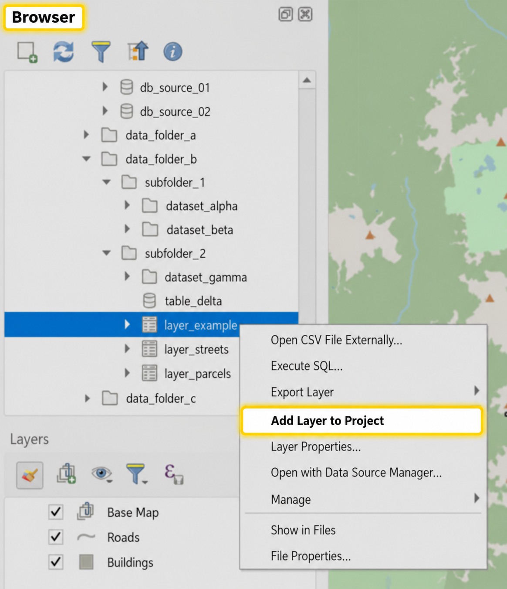

# Working with data in QGIS

[Home](../README.md)

QGIS supports many types of data.  The native format for QGIS is the Geopackage(.gpkg).  A Geopackage is just a SQLite database container with a standard schema governed by the OGC [Specification](http://docs.opengeospatial.org/is/18-000/18-000.html).  QGIS also provides excellent support of the Shapefile **(.shp)** format.

Supported [Vector](https://gdal.org/drivers/vector/index.html) and [Raster](https://gdal.org/drivers/raster/index.html) Formats

## Index

* [Choosing the right way to add data](#choosing-the-best-way-to-add-data)

  * [Quick comparison of data loading methods](#quick-comparison-of-data-loading-methods)
  * [Which method should I use?](#which-method-should-i-use)

* [Adding data to QGIS](#adding-data-to-qgis)
  
  * [Adding data by dragging and dropping](#adding-data-using-drag-n-drop)
  * [Adding data using the Browser](#adding-data-using-the-browser)
  * [Adding data using Data Source Manager](#adding-data-using-data-source-manager)
  * [Adding data from Layer Library](#adding-data-from-layer-library)

* [Adding database layers](#adding-database-layers)

  * [Adding Oracle data using the Browser panel](#adding-oracle-data-using-the-browser-panel)
  * [Adding Oracle data using Data Source Manager](#adding-oracle-data-using-data-source-manager)
  * [Adding Oracle data using DB Manager](#adding-oracle-data-using-db-manager)
    
  
 ## Choosing the best way to add data

QGIS provides several ways to add layers to a project. These methods can overlap, but each one is useful for a different type of workflow. The table below focuses on adding existing layers to QGIS.

### General ways to add layers

| Method              | Best used for                                                                                           | Notes                                                                                                                              |
| ------------------- | ------------------------------------------------------------------------------------------------------- | ---------------------------------------------------------------------------------------------------------------------------------- |
| Drag and drop       | Quickly adding local files                                                                              | Useful when the file is already saved on your computer or a network drive and you know where it is located.                        |
| Browser panel       | Browsing and adding files, folders, databases, GeoPackages, web services, projects, scripts, and models | Useful when you want to explore available resources before adding them to the map.                                                 |
| Data Source Manager (Ctrl+Shift+L/Ctrl+O) | Adding data through a guided interface organized by source type                                         | Useful when adding vector, raster, delimited text, database, or web service layers from one dialog.                                |
| DB Manager          | Adding or creating layers from database tables and SQL queries                                          | Useful for database workflows where you need to inspect tables, run SQL, or create query layers before adding them to the project. |

### Ways to add BCGW data

| Method              | Best used for                                                        | Notes                                                                                              |
| ------------------- | -------------------------------------------------------------------- | -------------------------------------------------------------------------------------------------- |
| Layer Library       | Finding and adding commonly used B.C. government layers              | Best starting point when the layer is available through the curated Layer Library workflow.        |
| Browser panel       | Adding known BCGW layers directly from the Oracle connection         | Useful when you know the schema or table name and want to browse the database connection directly. |
| Data Source Manager | Adding BCGW database layers through a source-specific loading dialog | Useful when you want to add database layers through the Data Source Manager interface.             |
| DB Manager          | Querying BCGW tables before adding them to the project               | Useful when you need to filter, subset, join, or run SQL before loading the result as a layer.     |

**Note: The Browser can be opened as a panel in the main QGIS interface or as a tab inside Data Source Manager.

## Adding data to QGIS

### Drag and Drop

### Adding data using the Browser

Use the Browser for quick access to files, folders, databases, GeoPackages, and services.

Open the Browser from:

```text
View > Panels > Browser
```

or:

```text
Ctrl+2
```

You can also use the **Browser** tab inside **Data Source Manager**.

To add data: browse to the data source > right-click the layer > select **Add Layer to Project**.



The Browser is usually the fastest option when you already know where the data is located.

### Adding data using Data Source Manager

Use **Data Source Manager** when you want to add data by source type, such as vector, raster, delimited text, GeoPackage, database, or web service data.

Open **Data Source Manager** from `Layer > Data Source Manager`, or use the Data Source Manager toolbar icon .
Keyboard shortcuts: *Ctrl+L* or *Ctrl+Shift+O*

To add data: choose the source type > connect to or browse to the data source > select the layer or table > click **Add**.

Data Source Manager organizes different loading options in one place. Later sections use it for more specific workflows, including database and web service connections.

### Adding data from Layer Library

The BCGOV layer library provides standardized style and data definitions for corporate datasets. Once [SLYR is installed](slyr.md), add the location of the BCGov Corporate Layer Library to your favorites, navigate through the folder categories, right click the layer and choose *Add selected layer(s) to project*


You can add data from ArcGIS online feature service.  BC MapHub feature services can be accessed with this URL https://maps.gov.bc.ca/arcserver/rest/services/mpcm/bcgwpub/MapServer/

In the browser panel right click on the Add ESRI Feature service and create new


## Adding database layers
### Adding Oracle data via browser panel
With the Browser panel open right-click the  and click *New Connection....*

Chances are you will want to add the BCGW database. From the GTS, enter the following:
- Database: idwprod1.bcgov
- Host: bcgw.bcgov


Find your new connection and expand the contents so you can choose the table you want to add to your map.  

> **_NOTE:_** The Oracle connection can be quite slow sometimes taking a few minutes to display all the data and tables in the system. Be patient. <br> <br> To avoid retrieving tables each time you open QGIS, load tables from the **Data Source Manager** (CTRL+SHIFT+O). This also allows for choosing a primary key, as QGIS will occasionally default to the wrong column when loading from the browsler panel, producing a "Layer is not valid" error.

### Adding Oracle Data via DB Manager
Once you have established your oracle connection you can start DB Manager from the Database menu.  Select and connect to your Oracle database from the  provider section. When you are connected you can expand the table list and right-click and choose *Add to project...*

 [QGIS Documentation](https://docs.qgis.org/testing/en/docs/user_manual/plugins/core_plugins/plugins_db_manager.html).
 
 More on [DB Manager](./database-manager.md).

To make an SQL layer from your oracle connection connect to your Oracle connnection as above, then click the  to edit your SQL.  Using a bounding box method shown below is one way to reduce the number of records and geometries and will significantly improve your oracle experience with QGIS.


Below is an example for subseting VRI table using a bounding box.  This can easly be modified to do more by modifying the select, where clause, or adding joins.  This is a powerful tool. Use it.
```sql
/* Oracle has a seemingly overly complex way of describing a bounding box
    GEOMETRY is the name of the geometry column (GEOMETRY or SHAPE for BCGW)
    The bounding box is created by
     by creating a SDO_GEOMETRY object
        2003 means it is a polygon geometry type (SDO_GTYPE)
        3005 is the BCALBERS SRID  (SDO_SRID)
        NULL is the SDO_POINT_TYPE (this is a polygon afterall)
        SDO_ELEM_INFO_ARRAY tells oracle how to interpret the ordinates
        SDO_ORDINATE_ARAY is the list of verticies the make up the above
        -clear as mud
 */  

select * from WHSE_FOREST_VEGETATION.VEG_COMP_LYR_R1_POLY where
SDO_ANYINTERACT (GEOMETRY,
	SDO_GEOMETRY(2003, 3005, NULL,
		SDO_ELEM_INFO_ARRAY(1,1003,3),
		SDO_ORDINATE_ARRAY(1589617.4,517052.4,1668136.6,578525.3) 
	)
) = 'TRUE'
```
>A handy tip for getting the extent of your analysis area - on the right, beside the coordinate box at the bottom of the QGIS window is a button that toggles the coordinate box between mouse coordinate location and map extent.  Toggle on the extent and click in the coordinates, ctrl-A, ctrl-C and paste it into your sql statement above.


## Working with vector layers
### Create New Vector Layers
[QGIS Documentation Link](https://docs.qgis.org/testing/en/docs/user_manual/managing_data_source/create_layers.html#id10)

Be sure to check out:  

GIS-Pantry Documentation
* [Scratch and Virtual Layers](Geodatapackage_and_otherformats.md)  

QGIS Documentation  
* [Temporary Scratch layer](https://docs.qgis.org/testing/en/docs/user_manual/managing_data_source/create_layers.html#id15)
* [Virtual layers](https://docs.qgis.org/testing/en/docs/user_manual/managing_data_source/create_layers.html#id22)

## Select by location
Select by location tool isn't found with the other selction tools. You can find select by location in the Vector menu under Research Tools.

## Create grids and samples
You can find grid and sample creation tools in the Vector menu under Research Tools.


## Joining Data
[QGIS DOCS](https://docs.qgis.org/testing/en/docs/user_manual/working_with_vector/vector_properties.html#joins-properties)  
QGIS allows joining data by a common field. The join field dialog is accessed through the layer properties under Joins. To add a join from this dialog click the  This will launch the Add Vector Join dialog where you can define your join with the properties:<br>
1.  Join Layer - the layer or table to join to the current layer
2.  Join Field - the join field from the layer or table defined in (1)
3.  Target Field - the field from your source layer to which the attributes from (2) will be joined
4. Toggle to cache the joined table in memory without geometry to speed up attribute lookups
5. Toggle joined field to only join a select number of fields from a table
6. Change the prefix for the joined fields

Additional joins can be added from other layers/tables and joins can be edited with the edit button  or removed using the remove button 

Example of creating a join:<br>


---
[Back to Top](#Working-with-data-in-QGIS)
